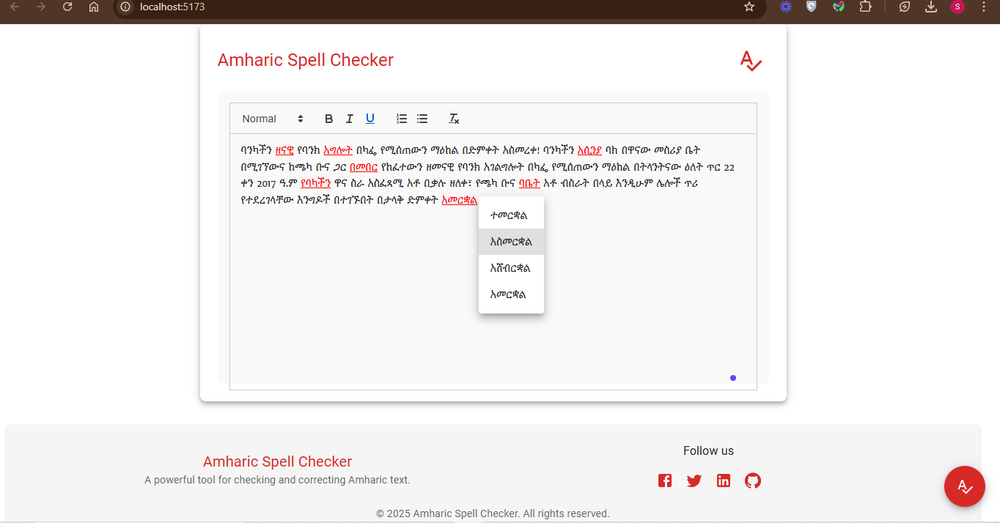

# Amharic Spell Checker

<p align="center">
  A powerful spell checking solution for the Amharic language, built with FastAPI and React.
</p>

## 🌟 Overview

This simple amharic spell-checking solution designed specifically for the Amharic language. It addresses the unique challenges of Amharic as a low-resource language by providing intelligent spelling assistance through advanced natural language processing techniques. The system aims to enhance writing accuracy and efficiency for Amharic text content.

## ✨ Key Features

- 🚀 **UltraFast Error Detection** - Efficient and quick spell checking
- 🧠 **Context Aware Suggestion** - Intelligent suggestions based on context
- 🏷️ **Part of Speech Tagging** - Accurate grammatical analysis
- 🔌 **API Interface** - Easy integration with other applications

## 🛠️ Tech Stack

### Backend
- Python 3.x
- FastAPI
- PyTorch
- Natural Language Processing Tools

### Frontend
- React
- Vite
- Material-UI
- Axios

## 🚀 Getting Started

### Prerequisites

- Node.js (v14 or higher)
- Python 3.x
- pip
- Git
## 📁 Project Structure
```
├── Amharic-spell-checker/
  ├── backend/
  │ ├── src/
  │ │ ├── spell_checker.py
  │ │ ├── spell_checker_pos.py
  │ │ ├── edit_distance.py
  │ │ ├── ngram.py
  │ │ ├── file_reader.py
  │ │ ├── tokenizer.py
  │ │ ├── normalizer.py
  │ │ ├── dictionary.py
  │ │ ├── utils.py
  │ │ ├── preprocessing.py
  │ │ └── main.py
  │ │
  │ ├── models/
  │ │ ├── am_pos_model.pt
  │ │ ├── bigram_model.pt
  │ │ └── trigram_model.pt
  │ │
  │ ├── data/
  │ │ ├── amharic_dictionary.txt
  │ │ └── amharic_corpus.txt
  │ │
  │ ├── tests/
  │ │ ├── test_edit_distance.py
  │ │ ├── test_normalizer.py
  │ │ ├── test_preprocessing.py
  │ │ └── test_spell_checker.py
  │ │
  │ ├── requirements.txt
  │ └── README.md
  │
  └── frontend/
  ├── src/
  │ ├── assets/
  │ ├── App.jsx
  │ └── main.jsx
  │
  ├── public/
  ├── index.html
  ├── package.json
  └── vite.config.js
```
### 🔧 Setup

#### Backend

1. **Navigate to the backend directory**:
   ```sh
   cd backend
   ```

2. **Install the required dependencies**:
   ```sh
   pip install -r requirements.txt
   ```

3. **Run the backend server**:
   ```sh
   uvicorn src.main:app --reload --port 8000
   ```

   The backend server will be running at `http://127.0.0.1:8000`.

#### Frontend

1. **Navigate to the frontend directory**:
   ```sh
   cd frontend
   ```

2. **Install the required dependencies**:
   ```sh
   npm install
   ```

3. **Run the frontend development server**:
   ```sh
   npm run dev
   ```

   The frontend server will be running at `http://127.0.0.1:8000`.

### 🧪 Testing the Application

1. **Ensure both the backend and frontend servers are running**.

2. **Open your browser and navigate to the frontend URL**:
   ```sh
   http://127.0.0.1:8000
   ```
3. **Use the application**:
   - Enter or paste Amharic text in the input field which contains both misspelled and correctly spelled Amharic words.
   - The application will check the spelling and underline the misspelled words with a red line. The user can put the cursor on the misspelled word and right-click to display suggestions for corrections in a menu. You can then select the best match to correct the word, as shown in the figure.


<!-- - figure  -->



### 📊 Evaluating the Model

1. **Navigate to the backend directory**:
   ```sh
   cd backend && src
   ```

2. **Run the evaluation script**:
   ```sh
   python evaluate_model.py
   ```

   This script will evaluate the model's performance and display the accuracy.
